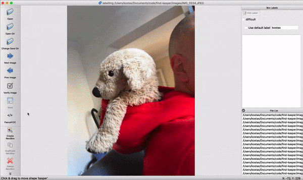

# Find Kasper

> Niveau: let øvet

Dette repository indeholder kode til at finde min søns hundebamse på billeder. Hundebamsen hedder Kasper.

Du kan naturligvis skifte hundebamsen ud med hvad du vil, men lad os antage at det er Kasper du gerne vil finde på billeder. Her er et billede af Kasper.

Første skridt er, at indsamle en masse billeder af Kasper. Vi skal bruge cirka 300 billeder af Kasper i forskellige situationer. I mappen `images` finder du en masse billeder af Kasper, som min søn har taget.

Næste skridt er, at markere hvor Kasper er placeret på hvert billede. For at træne en algoritme skal vi bruge en label for hvert sted hvor Kasper findes på et billede. Dine labels er de eksempler som algoritmen skal lære fra, så sørg for at være præcis når du angiver hvor Kasper er i billedet. Jeg anbefaler, at du bruger programmet [https://github.com/tzutalin/labelImg](https://github.com/tzutalin/labelImg) til at oprette labels.

I programmet vælger du om labels skal gemmes i enten PascalVOC format eller YOLO format. Vælg PascalVOC hvis du vil bruge Google's TensorFlow senere og YOLO hvis du vil bruge Joseph Redmons YOLO model.

## Træning af algoritme

Først skal vi bruge noget træningsdata. Følg tjeklisten herunder.

- Tag 300 billeder af en bestemt ting, som du vil kunne genkende. Billederne skal være i JPEG format og gemmes i mappen 'images_raw'.
- Kør `python shrink_images.py`, hvilket gør billerne mindre og kopierer dem til mappen 'images'.
- Kør `python bbox_label_too.py` hvilket starter en GUI hvor du kan markere en kasse omkring det objekt du har valgt på alle billederne. Sørg for at være nøjagtigt når du markerer hvor objektet er og gør det ligesom på billedet ovenfor. Obs: virker kun med Python 2.

Herefter kan vi træne vores algoritme til at finde Kasper. Vi kan benytte en af nedenstående metoder.

### TensorFlow Object Detection API

Vi kan benytte TensorFlows object detection API til det. Denne fremgangsmåde er baseret på følgende lektioner:
- [Installing TensorFlow for Object Detection](https://pythonprogramming.net/introduction-use-tensorflow-object-detection-api-tutorial/)
- [Custom objects tracking with TensorFlow](https://pythonprogramming.net/custom-objects-tracking-tensorflow-object-detection-api-tutorial/?completed=/video-tensorflow-object-detection-api-tutorial/).

<iframe width="560" height="315" src="https://www.youtube.com/embed/K_mFnvzyLvc" frameborder="0" allow="autoplay; encrypted-media" allowfullscreen></iframe>

## Darknet Yolo v3
