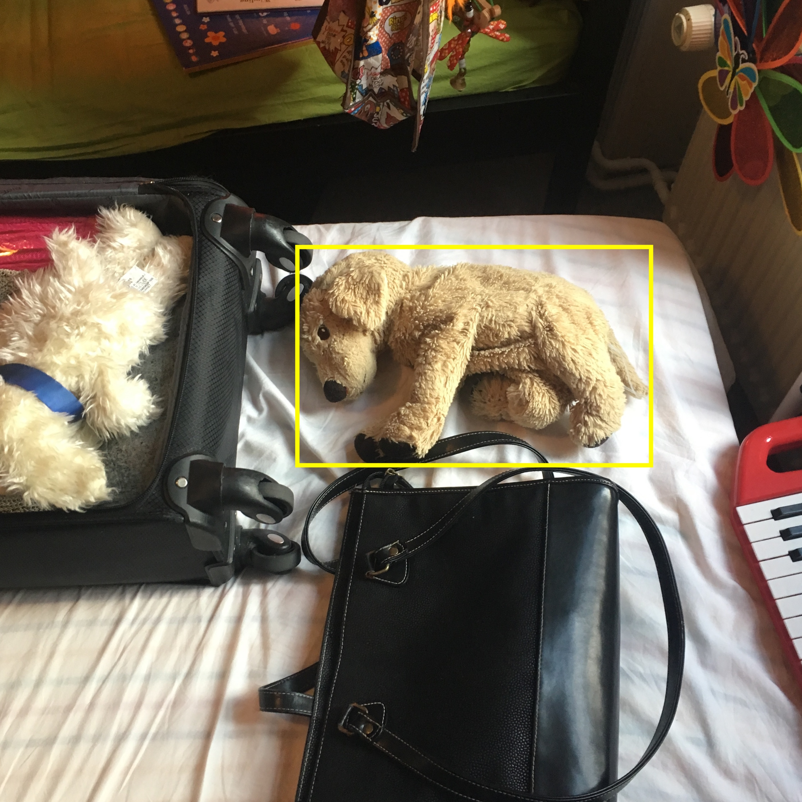

# Find Kasper

> Niveau: let øvet

Dette repository indeholder kode, der kan finde min søns hundebamse, Kasper, på et billede. Før koden kan finde Kasper skal den trænes på en masse billeder af Kasper, cirka 300 billeder.

Du kan naturligvis skifte hundebamsen ud med hvad du vil, men vi lader som om det er Kasper vil vil kunne genkende.

Her er et billede af den "rigtige" Kasper.

Du kan naturligvis skifte hundebamsen ud med hvad du vil, men vi kalder tingen
for Kasper ligemeget hvad det er. Du skal bruge cirka 300 billeder af Kasper for at træne koden til at genkende ham.

## Trin for trin

Først skal vi bruge noget træningsdata. Følg tjeklisten herunder.

- Tag 300 billeder af en bestemt ting, som du vil kunne genkende. Billederne skal være i JPEG format og gemmes i mappen 'images_raw'.
- Kør `python shrink_images.py`, hvilket gør billerne mindre og kopierer dem til mappen 'images'.
- Kør `python bbox_label_too.py` hvilket starter en GUI hvor du kan markere en kasse omkring det objekt du har valgt på alle billederne. Sørg for at være nøjagtigt når du markerer hvor objektet er og gør det ligesom på billedet ovenfor. Obs: virker kun med Python 2.
- Kør `python configure.py` for at oprette konfigurationsfiler i det format som [darknet](https://pjreddie.com/darknet/yolo/) forventer.

Installer darknet:
- Følg [installationsvejledningen](https://pjreddie.com/darknet/install/) på hjemmesiden for darknet.
- Opret et link til darknet:
`ln -s <sti-til-darknet-eksekverbar> darknet`
- `wget https://pjreddie.com/media/files/darknet53.conv.74`
